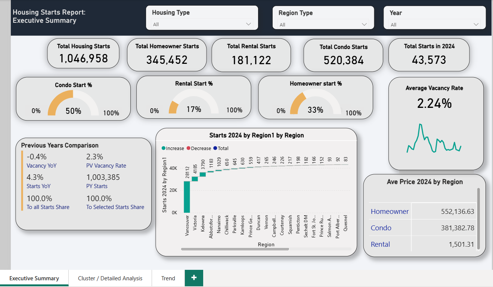
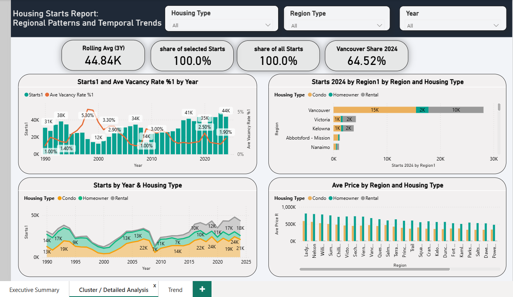
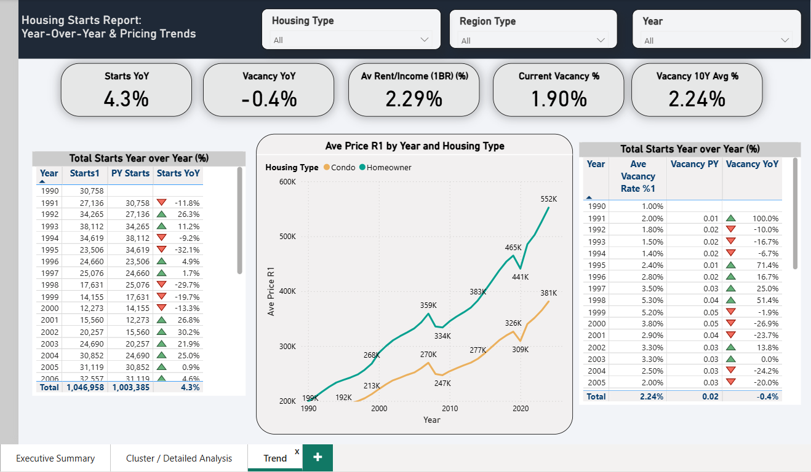

# BC Housing Market Analytics

## Project Overview

This Power BI analytics project explores housing market trends across British Columbia, focusing on housing starts, vacancy trends, affordability indicators, and regional housing development patterns.

The dashboard was designed to support executive-level reporting and help stakeholders understand how housing supply has changed over time and how it relates to rental availability and market affordability.

---

## Business Objectives

- Analyze housing starts over time
- Compare regional housing development patterns
- Evaluate rental availability through vacancy rate trends
- Monitor affordability and pricing indicators
- Support executive-level housing market reporting

---

## Dashboard Pages

### Executive Summary
Provides a high-level view of housing starts, housing type distribution, vacancy rate, regional performance, and key market indicators.

### Regional Analysis
Compares housing development patterns across BC regions and housing types.

### Trend Analysis
Tracks long-term housing starts, vacancy rates, pricing trends, and year-over-year changes.

---

## Tools & Technologies

- Power BI
- DAX
- SQL
- Power Query
- Data Modeling
- Excel

---

## Repository Structure

- `screenshots/` — Dashboard page previews
- `sql/` — Data cleaning and preparation scripts
- `dax/` — Power BI DAX measures used for KPI calculations
- `docs/` — Project documentation and dashboard requirements

---

## Key KPIs

- Total Housing Starts
- Condo Starts
- Homeowner Starts
- Rental Starts
- Average Vacancy Rate
- Starts YoY Change (%)
- Rolling Average (3Y)
- Share of Selected Starts (%)

---

## Dashboard Screenshots

### Executive Summary

### Cluster / Detailed Analysis

### Year-Over-Year & Pricing Trends

